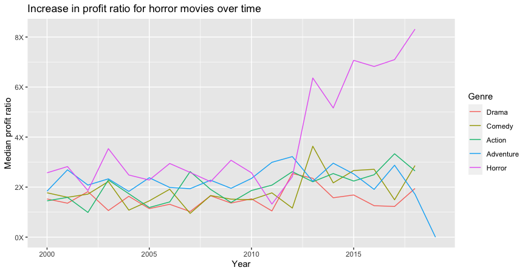

# TidyTuesday

*Explanotary Data Analysis* on the fly ... 

### Coolest snippets and pearls


#### Analizing Majors

```r
# reordering variables in descending order, nice for graphs, not working if NAs are present
mutate(variable = fct_reorder(variable, reorder_by))
```

#### Horror movies EDA



```r
# filter only 6 most common categories
mutate(distributor = fct_lump(distributor, n = 6)
```

```r
# turn the datafram upside down with row_numbers()
arrange(desc(row_number()))
```

```r
# extract the dacade out of the release_date
10 * floor(year(movie_profit$release_date) / 10)
```

```r
# creates a nice summarisation for multiple variables at once
summarise_at(vars(production_budget:worldwide_gross), median)
```

```r
# custom labeling of the y or x axis ... damn cool 
scale_y_continuous(labels = function(x) paste0(x, "X"))
```

```r
# 44:14 x axis shoul be on a free scale and not similar for all facets
facet_wrap(~ distributor, scales = "free_x")
```
